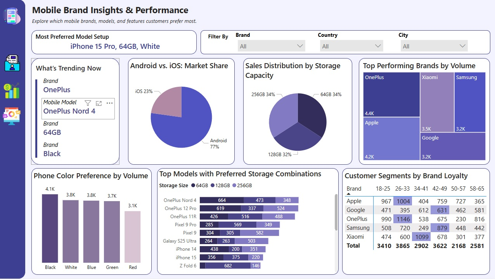
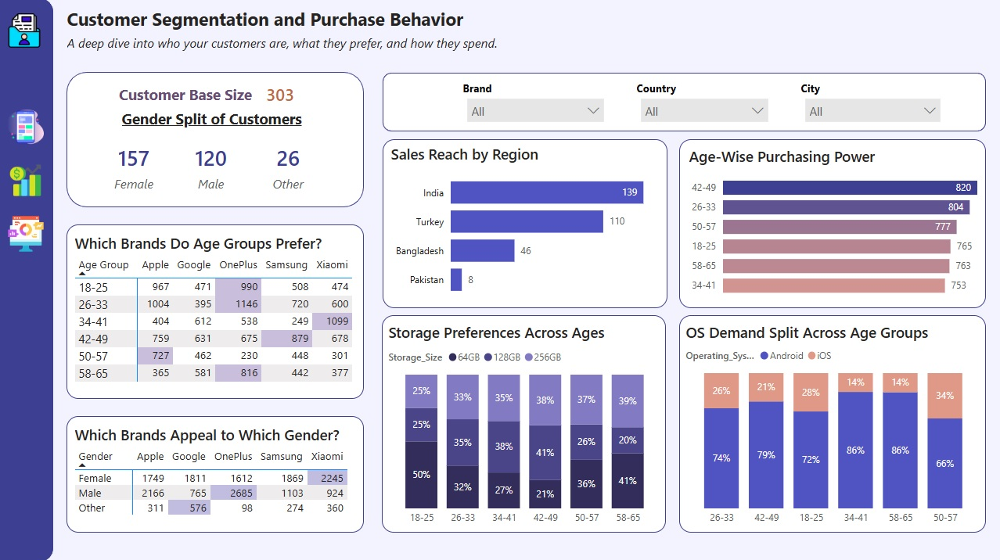
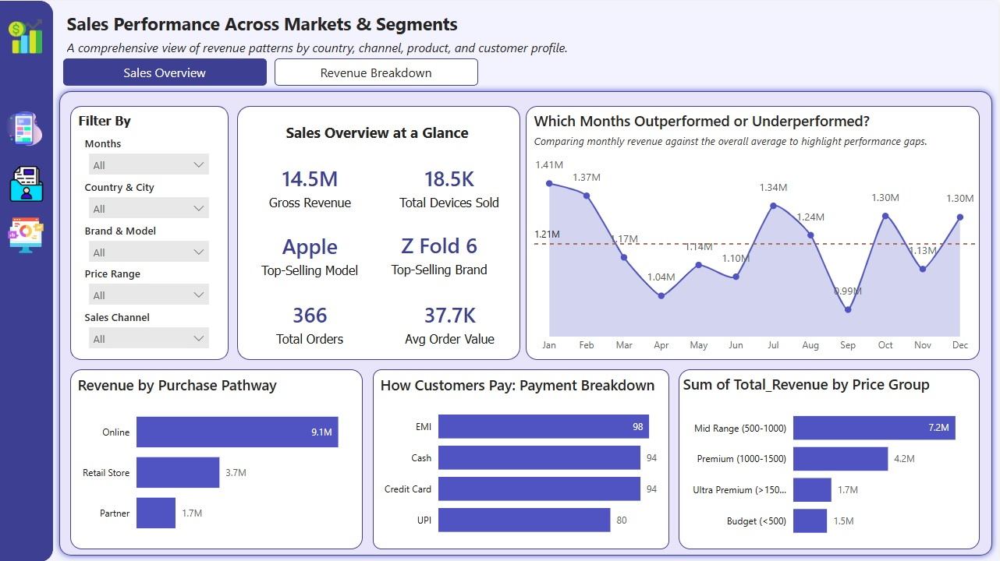
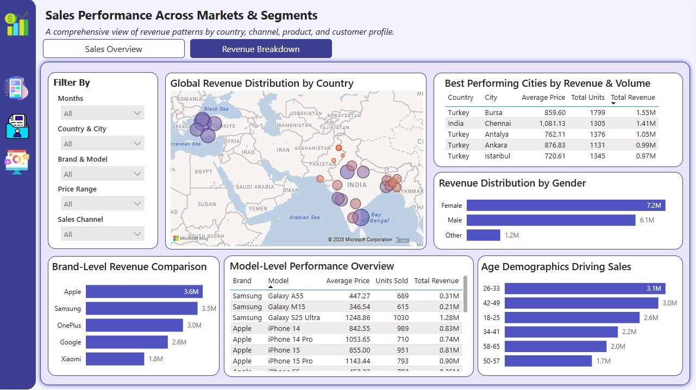

# 📱 Mobile Retailer Sales Analysis (Power BI)  
**DataDNA May 2025 Monthly Challenge**

This Power BI dashboard explores mobile phone sales performance across countries, brands, customer segments, and payment methods — using 2024 transaction data from a global retailer.

---

## 🎯 Objective

As a data analyst at a global mobile phone retailer, your goal is to:

- Identify top-performing brands and models
- Understand customer buying behavior by demographics
- Evaluate performance across sales channels and payment types
- Detect seasonal and regional sales trends
- Support strategy with data-driven insights

---

## 📊 Key Insights

### 📱 Brand & Product Performance
- **OnePlus** leads in total unit sales  
- **Apple** contributes over 25% of revenue despite fewer units sold — dominating the premium segment  
- **Black** and **White** are top color choices  
- Storage sweet spots: **64GB** and **256GB**

### 👥 Customer Segments
- Top spenders: **26–33** and **42–49** age groups  
- **Female customers** lead revenue share at 50%  
- Brand preferences by gender:
  - Females: Xiaomi  
  - Males: OnePlus  
  - Non-binary: Google  

### 💳 Revenue & Sales Channels
- Total Revenue: **$14.5 million**  
- Units Sold: **18,500+**  
- Transactions: **303**  
- **Online sales** drive 62% of revenue  
- **EMI** is the top payment method, followed by credit card and cash  

### 🌍 Regional Trends
- **India** generates nearly 50% of all revenue  
- **Turkey** hosts 4 of the top 5 performing cities  
- **Chennai** ranks #2 in revenue, despite fewer units sold  
- **Pakistan** shows low revenue, hinting at untapped market potential  

### 📈 Time-Based Trends
- Strong revenue months: **Jan, Feb, Jul, Aug, Oct, Dec**  
- Opportunity months: **Apr, Jun, Sep, Nov** (for promotions)

---

## 📁 Dataset Structure

> 📁 Dataset provided as part of the **DataDNA May 2025 Challenge** by [Onyx Data](https://datadna.onyxdata.co.uk/challenges/).  
> The data contains mobile sales records across multiple countries, used for analytical practice and visualization.

The analysis is based on a mobile phone sales dataset with the following schema:

| Column Name         | Description |
|---------------------|-------------|
| `Transaction_ID`     | Unique transaction reference |
| `Transaction_Date`   | Date of purchase |
| `Mobile_Model`       | Phone model name |
| `Brand`              | Brand of phone |
| `Price`              | Unit price |
| `Units_Sold`         | Quantity sold |
| `Total_Revenue`      | Price × Units |
| `Customer_Age`       | Actual age |
| `Customer_Age_Group` | Age group bucket |
| `Customer_Gender`    | Gender identity |
| `Country`, `City`    | Location of transaction |
| `Sales_Channel`      | Online, in-store, or partner |
| `Payment_Type`       | EMI, card, cash, etc. |
| `Storage_Size`       | Internal storage (e.g., 64GB) |
| `Color`              | Device color |
| `Operating_System`   | Android / iOS |

---

## 🛠 Tools Used

- **Power BI Desktop**
- DAX Measures
- Custom Filters & Slicers
- Responsive Cards & Tooltips

---

## 📸 Dashboard Preview

> Upload screenshots from your PDF and include them below:

| Brand Insights | Customer Segmentation |
|----------------|------------------------|
|  |  |

| Sales Overview | Revenue Breakdown |
|--------------------|----------------|
|  |  |

---

## 📂 Repository Contents

mobile-retail-insights-2025/

├── README.md

├── Mobile Retailer Analysis.pdf

├── Mobile Retailer Analysis.pbix 

├── images/

└── data/

---

## 🏅 Recognition

> 📊 This report was developed for the **DataDNA Power BI Challenge (May 2025)** hosted by [Onyx Data](https://www.onyxdata.co.uk/datadna).

---

## 🔗 Connect with Me

  

---

